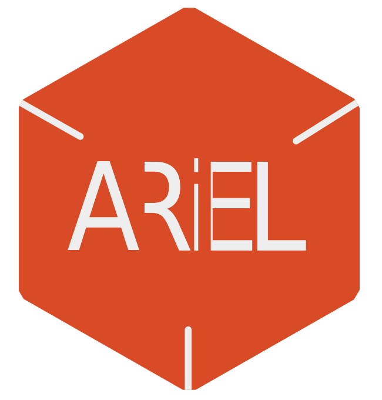

  

[![Build Status][build-badge]][build-info]
[![Book][book-badge]][documentation-mdbook]
[![Documentation][rustdoc-badge]][documentation-dev-rustdoc]
[![Matrix][matrix-badge]][matrix-link]
[![OpenSSF Best Practices][openssf-badge]][openssf-project-page]

Ariel OS is an operating system for secure, memory-safe, low-power Internet of Things (IoT).
It is based on Rust from the ground up
and [supports hardware](https://ariel-os.github.io/ariel-os/dev/docs/book/hardware-functionality-support.html)
based on 32-bit microcontroller architectures (Cortex-M, RISC-V, and Xtensa).

## Goals and Design

Ariel OS builds on top of existing projects from the Embedded Rust ecosystem, including [Embassy](https://github.com/embassy-rs/embassy), [esp-hal](https://github.com/esp-rs/esp-hal), [defmt](https://github.com/knurling-rs/defmt), [probe-rs](https://github.com/probe-rs/probe-rs), [sequential-storage](https://github.com/tweedegolf/sequential-storage), and [embedded-test](https://github.com/probe-rs/embedded-test).
While those provide high-quality building blocks for a wide range of embedded applications, such projects do not provide the high level of integration that developers know from contemporary C-based operating systems for microcontrollers, such as [RIOT](https://github.com/RIOT-OS/RIOT/) or [Zephyr](https://github.com/zephyrproject-rtos/zephyr) for instance.

Ariel OS thus follows an approach whereby it simultaneously integrates many heterogeneous pre-existing crates, and adds missing operating system functionalities such as a preemptive multicore scheduler, portable peripheral APIs, additional network security facilities, as well as [laze](https://github.com/kaspar030/laze), a meta-build system to bind it all together.
The result?
A powerful framework that allows to write portable embedded Rust applications with minimal boilerplate, providing a batteries-included experience.
Still have questions?
Check out our [FAQ](https://github.com/ariel-os/ariel-os/blob/main/FAQ.md) and/or take a look at the [Ariel OS book](https://ariel-os.github.io/ariel-os/dev/docs/book/).

## Getting Started

See the [Getting Started page][getting-started-mdbook] in the User Guide to get the [`hello-world` example][hello-world-example] running in less than 5 minutes.

## Minimum Supported Rust Version (MSRV) and Policy

Ariel OS compiles with stable Rust version 1.85 and up.
The MSRV can be increased in patch version updates.

## Security

If you think you may have found an issue that represents a security risk to Ariel OS users, please report it privately using [GitHub's Security section](https://github.com/ariel-os/ariel-os/security).

## Copyright & License

Ariel OS is licensed under either of

- Apache License, Version 2.0 ([LICENSE-APACHE](./LICENSE-APACHE) or http://www.apache.org/licenses/LICENSE-2.0)
- MIT license ([LICENSE-MIT](./LICENSE-MIT) or http://opensource.org/licenses/MIT)

at your option.

Copyright (C) 2020-2025 Freie Universität Berlin, Inria, Kaspar Schleiser

## Contributing

Contributions are very welcome!
Please see our [contributing guide](./CONTRIBUTING.md) for details.

Unless you explicitly state otherwise, any contribution intentionally submitted
for inclusion in the work by you, as defined in the Apache-2.0 license, shall
be dual licensed as above, without any additional terms or conditions.

Thanks to all the people who already contributed!

[build-badge]: https://github.com/ariel-os/ariel-os/actions/workflows/main.yml/badge.svg
[build-info]: https://github.com/ariel-os/ariel-os/actions/workflows/main.yml
[matrix-badge]: https://img.shields.io/badge/chat-Matrix-brightgreen.svg
[matrix-link]: https://matrix.to/#/#ariel-os:matrix.org
[book-badge]: https://img.shields.io/badge/Book-%F0%9F%93%94-blue
[rustdoc-badge]: https://img.shields.io/badge/Documentation-%F0%9F%93%94-blue
[documentation-mdbook]: https://ariel-os.github.io/ariel-os/dev/docs/book/
[documentation-dev-rustdoc]: https://ariel-os.github.io/ariel-os/dev/docs/api/
[getting-started-mdbook]: https://ariel-os.github.io/ariel-os/dev/docs/book/getting-started.html
[hello-world-example]: https://github.com/ariel-os/ariel-os/tree/main/examples/hello-world
[openssf-badge]: https://www.bestpractices.dev/projects/10610/badge
[openssf-project-page]: https://www.bestpractices.dev/projects/10610
