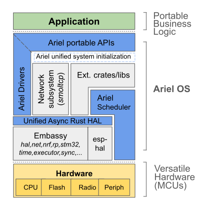

# Introduction

Ariel OS is an operating system for secure, memory-safe, networked applications
running on low-power microcontrollers.
It is based on Rust from the ground up
and [supports hardware](https://ariel-os.github.io/ariel-os/dev/docs/book/hardware-functionality-support.html)
based on 32-bit microcontroller architectures (Cortex-M, RISC-V, and Xtensa).
Many features provided by Ariel OS can individually be enabled or disabled at build time
in order to minimize resource consumption.

This is the manual of Ariel OS. Other resources available are:

- 🛠️ Reference documentation for Ariel OS can be found in the
  [API documentation](https://ariel-os.github.io/ariel-os/dev/docs/api/ariel_os/).
- ⚙️  The git repository is available on
  [GitHub](https://github.com/ariel-os/ariel-os).
- ✨ [Examples](https://github.com/ariel-os/ariel-os/tree/main/examples)
  demonstrate various features of Ariel OS.
- 🧪 A set of [test cases](https://github.com/ariel-os/ariel-os/tree/main/tests)
  further verifies the capabilities of Ariel OS.
- 🚧 The [roadmap](https://github.com/ariel-os/ariel-os/issues/242)
  shows the planned features for Ariel OS.

## Goals and Design

Ariel OS builds on top of existing projects from the Embedded Rust ecosystem, including
[Embassy](https://github.com/embassy-rs/embassy), [esp-hal](https://github.com/esp-rs/esp-hal),
[defmt](https://github.com/knurling-rs/defmt), [probe-rs](https://github.com/probe-rs/probe-rs),
[sequential-storage](https://github.com/tweedegolf/sequential-storage), and
[embedded-test](https://github.com/probe-rs/embedded-test).

Ariel OS follows an approach whereby it simultaneously integrates a curated ecosystem of libraries (available via crates.io),
and adds missing operating system functionalities as depicted below.
Such functionalities include a preemptive multicore scheduler, portable peripheral APIs,
additional network security facilities, as well as a meta-build system to bind it all together.

As a result, a low-power IoT developer can focus on business logic
sitting on top of APIs which remain close to the hardware but
nevertheless stay the same across all supported hardware,
inspired by what [RIOT](https://github.com/RIOT-OS/RIOT/) tends to in that regard.
The intent is three-fold: reduce application development time,
increase code portability, and minimize core system vulnerabilities.

In a nutshell: Ariel OS contributes to the global effort aiming to (re)write IoT system software
foundations on more solid ground than what traditional building blocks written in C can provide.
And this is a joyful and welcoming open-source community, so: [join us](https://github.com/ariel-os/ariel-os)!

<figure style="text-align: center; margin: 4em">
  
  <figcaption>Architecture diagram of Ariel OS</figcaption>
</figure>

## Further Reading

Even though not necessary for using Ariel OS, readers of this book might also want
to have a look at the following resources:

- [The Embedded Rust Book](https://docs.rust-embedded.org/book/): General information about how to use Rust for embedded and the structure of the Rust embedded ecosystem, which Ariel OS abstracts over.
- [Embassy Book](https://embassy.dev/book/): Hardware abstractions and async executors that Ariel OS builds on.
